# Machine Learning Engineer Capstone Project
## Starbucks Challenge
### by Mark-Danney Oonk

---

# Definition

## Project overview

Starbucks wants to target users of their app with personalized messages, giving its customers the best possible offers on the right channels in order to stimulate their spending behavior.

To this end, Starbucks ran a pilot with several different propositions and monitoring whether, and if so when, the offer was viewed. Any consequent spending behavior of the pilot customers was logged. Using this data I will train a machine learning model that can be exposed in an endpoint in order to provide the app, e-mail or online channels with the best offers for a given customer in real-time.

Starbucks has provided us with three related datasets:
- Profiles, containing information about customers such as age, gender, account age and income;
- a Portfolio of available offers describing their difficulty to attain the offer (required spending before a Buy one, Get one free (BOGO) kicks in for instance), offer duration and the amount rewarded;
- Transcripts of monetary transactions as well as the times offers were sent, viewed and completed by customers.

## Problem Statement

The problem is very similar to a so-called collaborative filtering personalization, where customers are recommended products based on their earlier interests similar to other customers that then recommended other products. Only in this case, the recommended products are new offers and recommendations made by others are them actually spending in order to complete the order.

Collaborative filtering personalization has in the past been successfully implemented using neural networks, so this will be the route taken for the problem at hand. The model will take in a customer's data and an offer's characteristics and predict the probability of the success of the offer and approximate the expected amount spent.

## Metrics

The model will be tested using a never-before-seen (by the model) test dataset and measured by a combination of Binary Crossentropy as a loss value, as this metric works well at measuring classification quality by penalizing erroneous classification [[2]](#2), and F-1 score to measure the precision and recall as the ratio of true/false negatives/positives is important: [[3]](#3)

- True Positive: Received offer will likely be used by the customer.
- False Positive: Send an offer but the customer doesn’t use it. Possibly annoying for the customer as they're 'spammed' with irrelevant offer, but not the end of the world.
- True Negative: Prevent the program from sending spam that wouldn't lead to increased sales anyway.
- False Negative: Offer wasn't sent, but would have led to a successful offer. This is the worst error as it directly affects sales.

# Analysis

## Data Exploration

### Portfolio

This dataset contains all offers that were sent during the pilot:

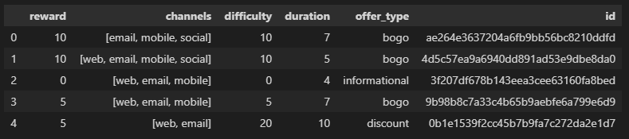

The portfolio dataset contains offers sent during 30-day test period (10 offers x 6 fields):

- reward: (numeric) money awarded for the amount spent
- channels: (list) web, email, mobile, social
- difficulty: (numeric) money required to be spent to receive reward
- duration: (numeric) time for offer to be open, in days
- offer_type: (string) bogo, discount, informational
- id: (string/hash)

It contains only properly filled records. Required preprocessing will be:

- One-hot encoding of Channels and OfferType
- Min-Max normalization of Reward, Difficulty and Duration to 0..1 values

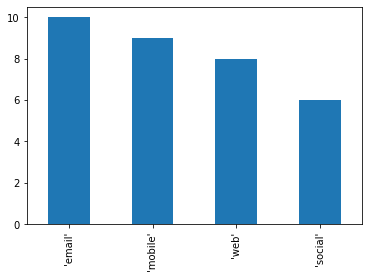

### Profile

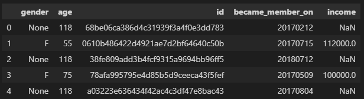

Profiles contain the rewards program users (17000 users x 5 fields)

- gender: (categorical) M, F, O, or null
- age: (numeric) missing value encoded as 118
- id: (string/hash)
- became_member_on: (date) format YYYYMMDD
- income: (numeric)

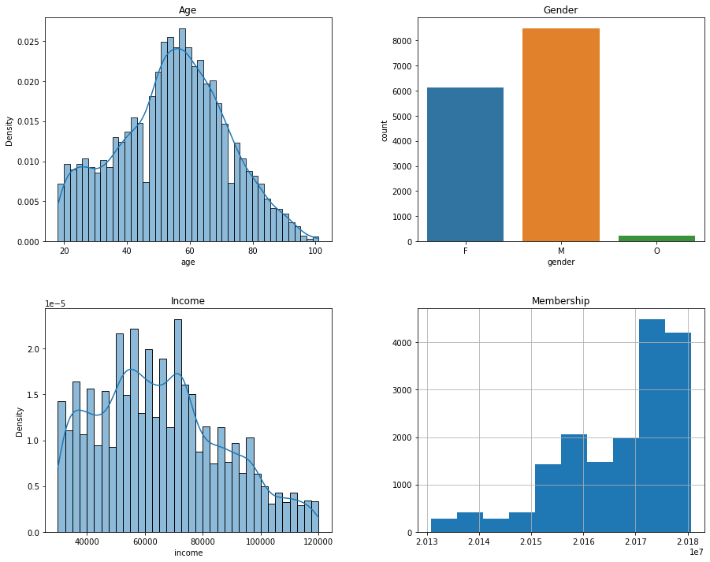

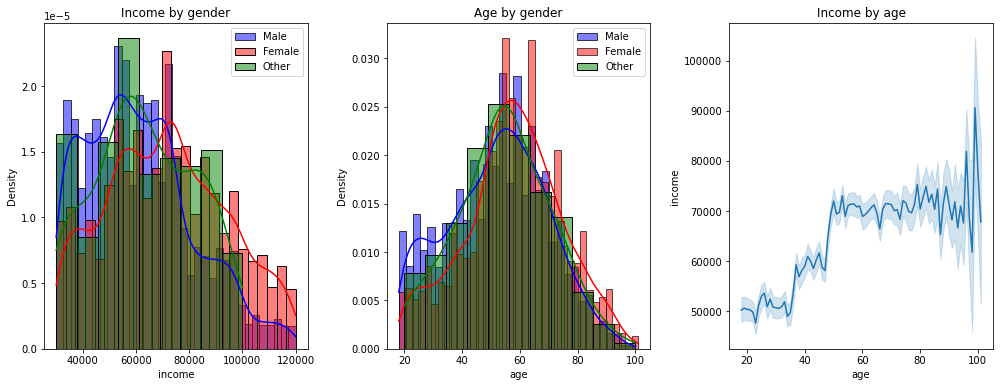

Observations:
- The participant age is fairly normally-distributed, with a skew to the 18-35 bracket as may be expected for app usage. Income however is quite irregular.
- Most accounts are presumed fairly new at the time this data was gathered.

For the project, membership age will be calculated in days from the last created account, so not all accounts start as 4 years old making the data unusable for more current accounts.

Almost 13% of the profiles aren't filled in correctly. Interestingly though, all of the profiles that contained missing values were missing all three Gender, Age and Income. This may indicate that the data isn't simply missing but may actually be purposefully not filled in by the user. This group may be analyzed as its own demographic to see if one can identify recurring spending behavior.

### Transcript

Lastly, this dataset consists of all transactions and offer actions by customers during the pilot and contains timestamps of when offers were received, viewed and completed as well as actual transactions and the amount of money spent.

Since the 'value' column contains JSON information, I'll unpack that into separate columns.

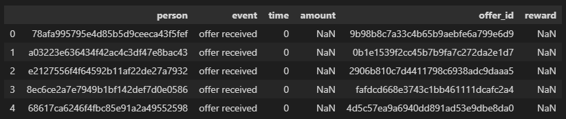

Transcripts contain event logs (306648 events x 4 fields)

- person: (string/hash); references the Profile.id column
- event: (string); the type of event the transcript describes; offer received, offer viewed, transaction or offer completed
- value: (dictionary); different values depending on event type:
  - offer id: (string/hash); references the Portfolio.id column, is empty for "transaction" events
  - amount: (numeric); money spent in "transaction" events
  - reward: (numeric); money awarded to customer from "offer completed" events
- time: (numeric) hours after start of the pilot the event took place

Although all events are filled properly, about 11% may need to be treated differently as they are related to the unfilled profiles.

Starbucks has warned about completed but not viewed offers; the customer may have received its reward but wasn't influenced by it because they didn't know about the offer contents. During preprocessing these offers will be treated as unsuccessful.

In the transcripts there the events are:

- transaction        138953
- offer received      76277
- offer viewed        57725
- offer completed     33579

# Methodology

## Data preprocessing

### Portfolio

Required preprocessing will be:

- One-hot encoding of Channels and OfferType
- Min-Max normalization of Reward, Difficulty and Duration to 0..1 values; this step will be taken at the very end as I will need the raw Duration for the Transcript engineering

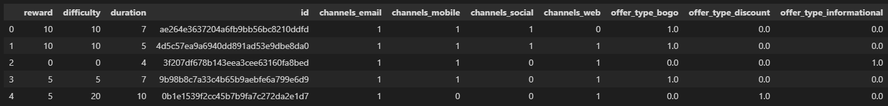

### Profile

- One-hot encoding of Gender, including setting unknown genders to 'U'
- Translating BecameMemberOn to AccountAge in days counted from newest account in the dataset
- Filling missing Age and Income fields with mean values for the respective columns
- Min-Max normalization of Age, Income and AccountAge to 0..1 values will be done at the end of preprocessing in order to get a fully fitted scaler for future use

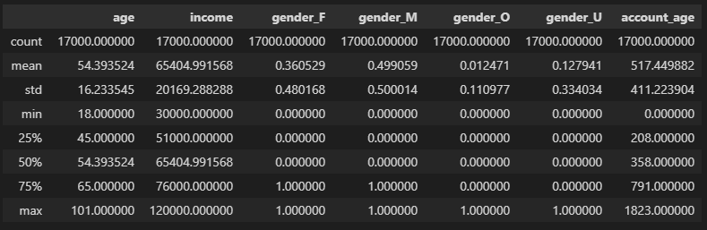

### Transcript

This is where the magic happens; to transform the data from loose events into (un-)successfully completed offers with the total money spent during the time the offer was active.

- Expand JSON column
- Merge events into complete histories per received offer with 
  - transaction totals between offer viewed and offer completed (or before the time limit has exceeded for informationals) and 
  - determine success per offer (offer was received, viewed and completed in that order)
- Merge in Person and Portfolio features, delete the id's
- Min-Max normalize all relevant features

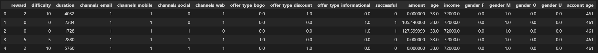

## Data analysis after processing

Now that I have some further information about the data like (un)successfully completed offers, let's have a deeper look.

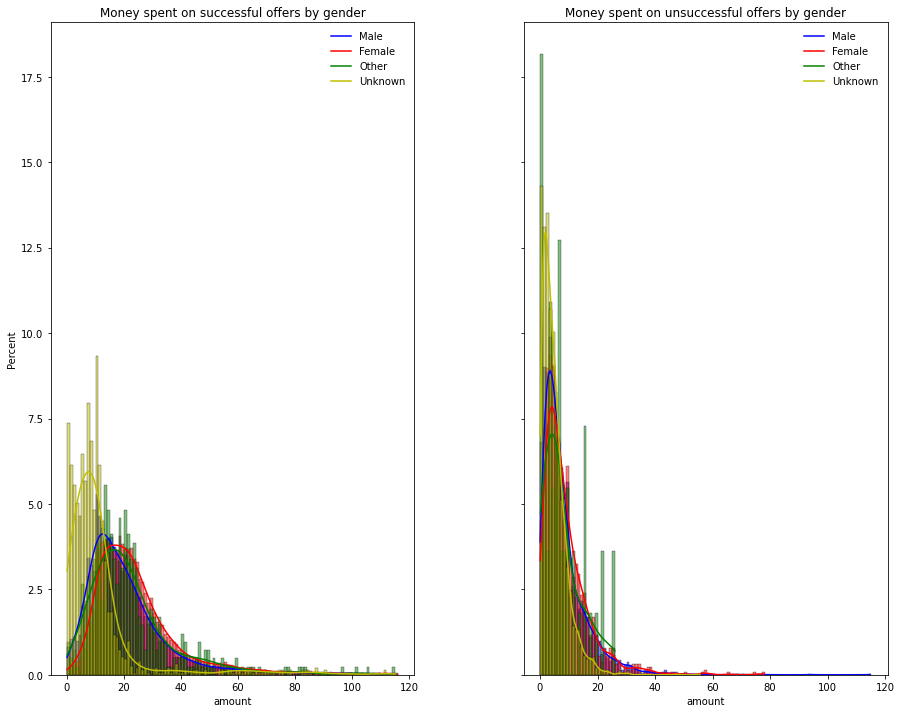

- As should be expected, successful offers entice people to spend more overall
- The population for people that refuse to fill in their data behaves wildly differently from other genders, spending less but more frequently. If Starbucks could successfully tap into this demographic with fitting offers to get them to spend more, this could be a huge win.
- Males seem to complete more offers while spending slightly less, but the difference is hardly significant.
- People who filled in 'Other' for their gender do spend less money and less often when not influenced by offers though, so the trick here would be to get them to view their offers more reliably.

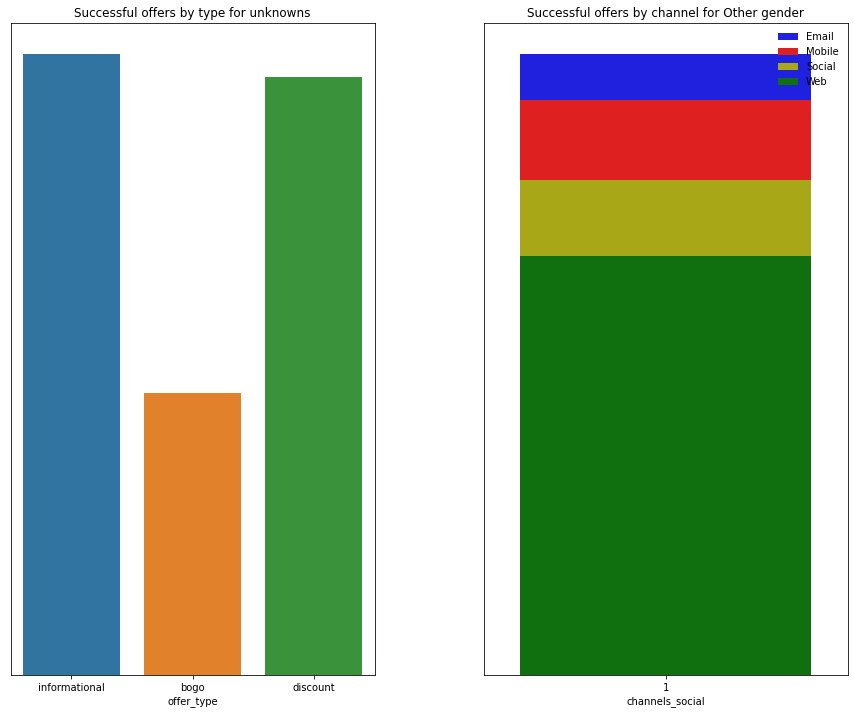

If there's anything to take away already for Starbucks, is that they should target people who refuse to fill in their data with more Discounts, and reach out to people who filled Other as their gender with Email campaigns.

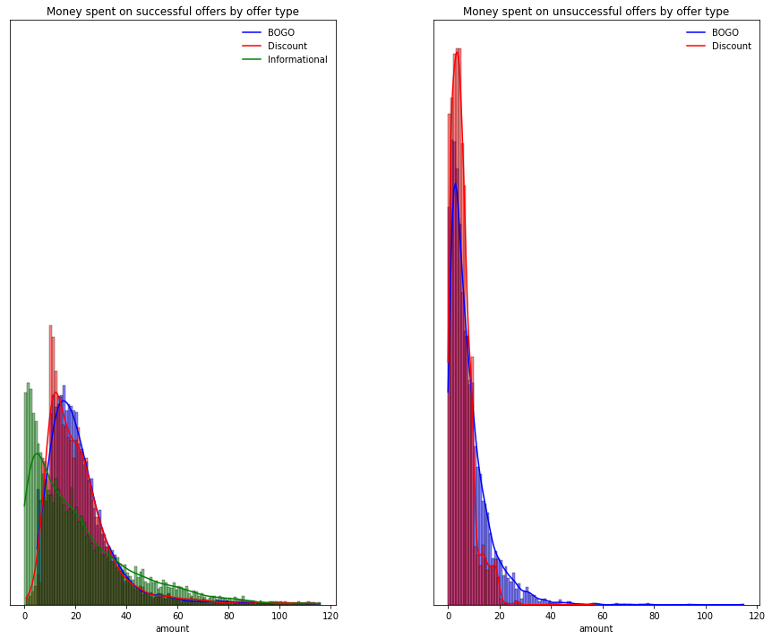

- As might be expected, informationals don't incite as much spending as other offer types.
- BOGO offers get people to spend slightly more, while discounts get used slightly more. Both are hardly significant though, so the effect should be found in differences in demographies.
- Again, the difference in money spent is clear between successful and unsuccessful offers; people that weren't influenced by offers spent far less. Even informationals triggered people to spend more to a degree as seen in the thicker 'tail' end of the green graph. 

## Benchmark

Before starting model training, a simple benchmark algorithm should be established.

For the model to be successful, it should at least recommend offers that would increase amount spent over normal spending (that is, without viewed offers or offers viewed after completion or duration runs out).

For my baseline data, I'll get all 'invalid' transactions; those that were in the timeframe of offers that were either:
- not viewed,
- viewed after offer duration runs out (in case of informationals) or
- viewed after completion of the offer.

These profiles can then be compared against predicted spending when the model does propose an offer.

```
Starbucks offer success is 47.66 %
Starbucks offer success not counting informationals is 41.20 %
```

The success rate of completed offers is 47.7%, so that's the score to beat.

## Model training and refinement

In the project proposal, I had the ambition to be able to take in a customer's data and based on that predict the best-performing offer and expected amount of money spent. To this end, a neural network will be trained. 

To start, I needed to know how the model could best be trained; how dense should the inner layers be, how fast the learning rate, how large should the dropout percentage between each layer be, should I use large or small batches... To accelerate this process, Keras' built-in Hyperband parameter tuning algorithm was used with a slight modification to be able to vary batch size.

The resulting parameters looked promising, with a good 86.3% accuracy.

Next, I split the data into training and test sets using the K-Fold algorithm. This was done because the remaining rows in the dataset after preprocessing and feature engineering were relatively few (~63000 rows, of which only about 30000 contained successful offers). So in stead of training a neural network on an increasingly small set as I shave off percentages of data for testing and validation, I used the K-Fold cross-validation method [[4]](#4) to prevent overfitting the model to testdata without limiting the amount of data I can use.

Each fold, the model was saved with the performance metrics in the filename. The results can be found in the /model/starbucks_[spending|success]/saved folders.

# Results

```
Scores for testset:
loss of 0.33673176169395447
acc of 0.8547497987747192
f1_m of 0.6333511471748352
precision_m of 0.47682446241378784
recall_m of 0.9655615091323853
```

Suffice it to say the model performed very well with an accuracy of 0.85 and f1 score of 0.63, with a fairly low precision offset by a very high recall of 0.97 on the test set. As I established in the [Metrics](#metrics) chapter, the recall is more important to Starbucks than the precision, where the model generates more spam but for a better offer success rate.

The parameters used to train this model were:

```
Trial 31 Complete [00h 04m 21s]
val_acc: 0.8635314702987671

Best val_acc So Far: 0.8635314702987671
Total elapsed time: 00h 26m 50s
{'dropout': 0.30000000000000004, 'units': 64, 'units_2': 96, 'learning_rate': 0.001, 'tuner/epochs': 2, 'tuner/initial_epoch': 0, 'tuner/bracket': 2, 'tuner/round': 0, 'batch_size': 16}

Model: "sequential_36"
_________________________________________________________________
Layer (type)                 Output Shape              Param #   
=================================================================
dropout_108 (Dropout)        (None, 50265, 17)         0         
_________________________________________________________________
dense_108 (Dense)            (None, 50265, 64)         1152      
_________________________________________________________________
dropout_109 (Dropout)        (None, 50265, 64)         0         
_________________________________________________________________
dense_109 (Dense)            (None, 50265, 96)         6240      
_________________________________________________________________
dropout_110 (Dropout)        (None, 50265, 96)         0         
_________________________________________________________________
dense_110 (Dense)            (None, 50265, 2)          194       
=================================================================
Total params: 7,586
Trainable params: 7,586
Non-trainable params: 0
_________________________________________________________________
```

- 2 Dense hidden layers with 64 and 96 nodes respectively, both with ReLu activations and a Dropout of 0.3
- Adadelta optimizer with learning rate 0.001
- Loss function CategoricalCrossentropy
- Batch size 16

I had used an early stopping callback to monitor the loss function that did trigger during other trials, but was obviously not necessary in this trial that determined 2 epochs to be the most optimal.


# References

<a id="1">[1]</a> https://outofmygord.com/2016/09/20/why-our-brains-are-blocking-ads/

<a id="2">[2]</a> https://www.tensorflow.org/api_docs/python/tf/keras/metrics/BinaryCrossentropy

<a id="3">[3]</a> https://towardsdatascience.com/metrics-to-evaluate-your-machine-learning-algorithm-f10ba6e38234

<a id="4">[4]</a> https://scikit-learn.org/stable/modules/cross_validation.html